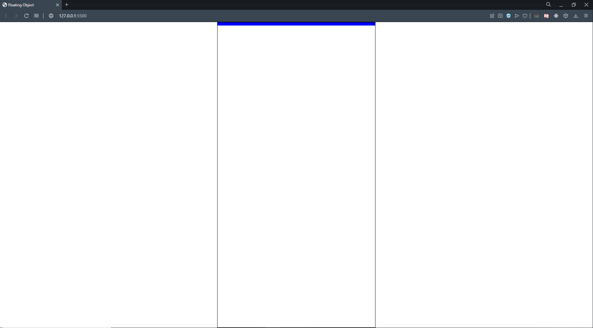
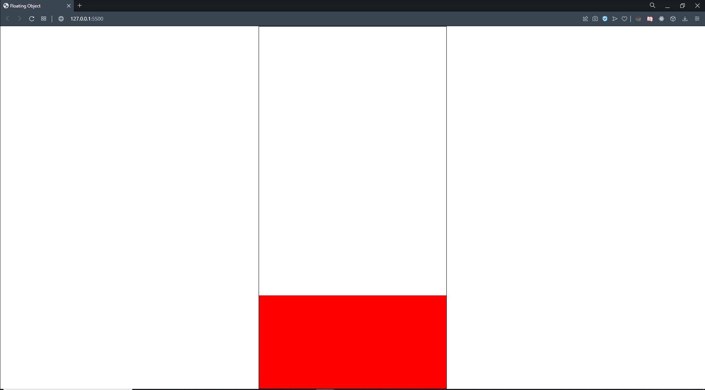

<!-- BODY -->
# JavaScript Floating Object

<!-- PROJECT IMAGES -->
## Project Images

### Project Image - 1


### Project Image - 2


### Project Image - 3


<br/>

<!-- ABOUT THE PROJECT -->
## About The Project
I developed this JavaScript project as an introductory project to manipulate DOM elements and create various animations. The working principles of this project, when the user presses the blue rectangle which is displayed on the stage, this rectangle moves linearly from top to bottom, adds the colors and heights of the randomly colored, sized, and positioned squares to its body and ends its movement when it reaches the bottom border.

<br/>

<!-- Technologies Used -->
## Technologies Used

This project is developed with the followings:

* [JavaScript](https://www.javascript.com)
* [JQuery](https://jquery.com)
* HTML
* CSS

<br/>

<!-- Setup/Installation -->
## Setup/Installation
 Clone the repository 
   ```sh
   git clone https://github.com/dyakupoglu/JavaScript-Floating-Objects.git
   ```

<br/>

<!-- LICENSE -->
## License

Distributed under the MIT License. See `LICENSE.txt` for more information.
